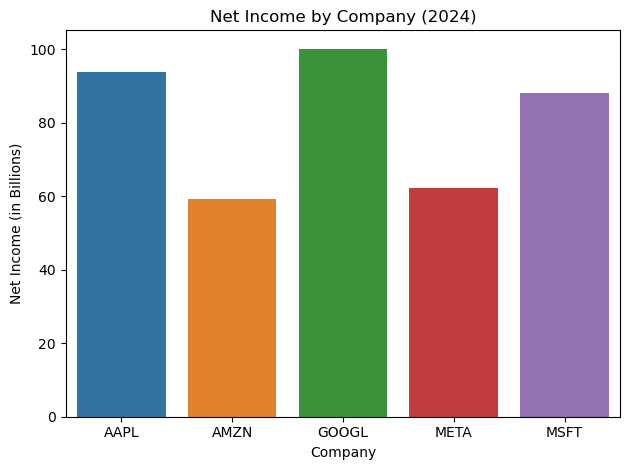
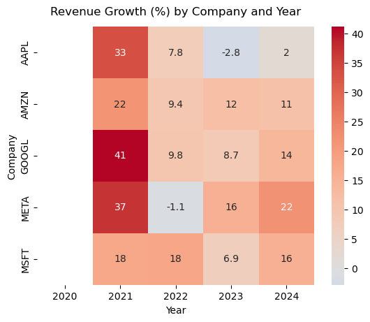
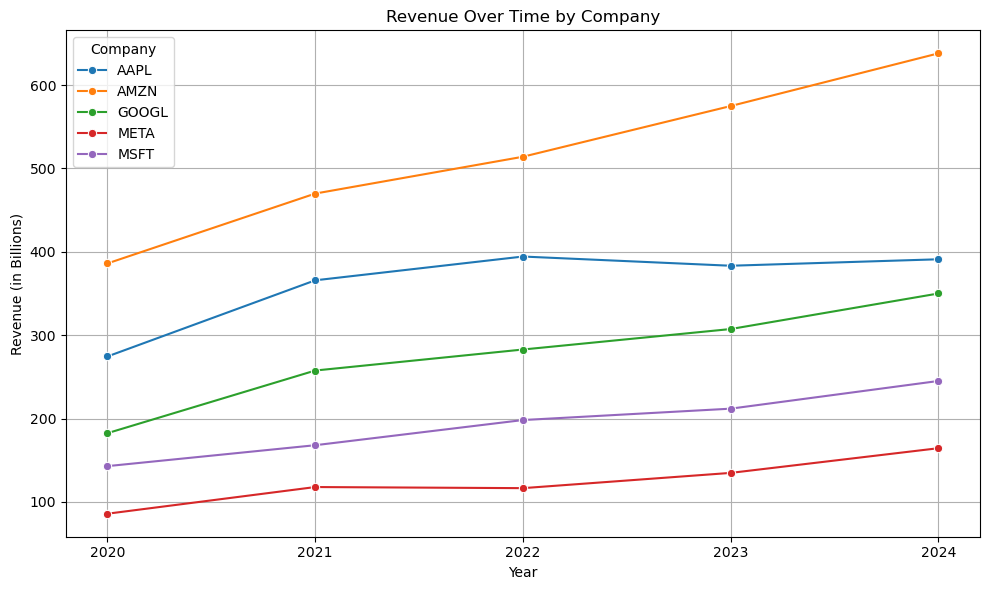
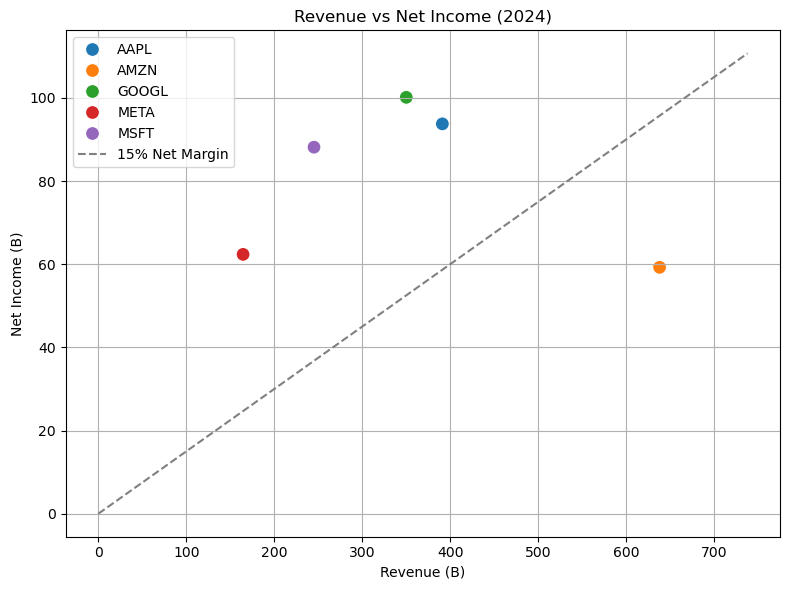
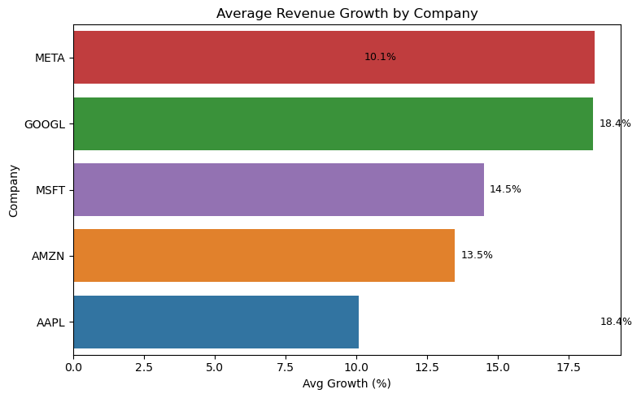
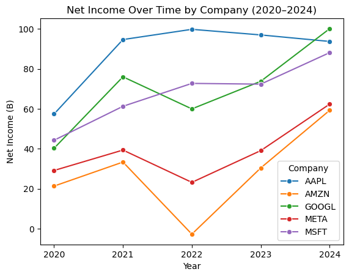

# 📈 Financial Analysis of Tech Giants (2020–2024)

A data-driven analysis of five major tech companies — Apple (AAPL), Amazon (AMZN), Google (GOOGL), Meta (META), and Microsoft (MSFT) — using financial data pulled from a public API.  
This project explores revenue, net income, growth trends, and business efficiency from 2020 to 2024 using Python and data visualization libraries.

---

## 🛠 Tools & Technologies

- **Python** (Pandas, NumPy)
- **Data API**: FinancialModelingPrep
- **Visualization**: Seaborn & Matplotlib
- **Export**: CSV for cleaned data & charts

---

## 📊 Key Analyses

- Year-over-year **Revenue & Net Income trends**
- **Revenue Growth %** heatmaps and bar charts
- **Profitability comparison** via scatter plots
- Identification of **outliers and revenue drops**
- Company **ranking by performance**

---

## 📁 Project Structure

```
Financial_Analysis_of_Tech_Giants/
├── 📁 CSV/                     ← Cleaned/exported datasets
│   ├── avg_revenue_growth_by_company.csv
│   ├── financial_data_cleaned.csv
│   └── tech_company_revenue_billions.csv
│
├── 📁 images/                  ← Saved charts and plots
│   ├── avg_revenue_growth.png
│   ├── net_income_2024.png
│   ├── net_income_over_time.png
│   ├── revenue_growth_heatmap.png
│   ├── revenue_over_time.png
│   └── revenue_vs_net_income.png
│
├── EDA.ipynb                  ← Jupyter notebook with full analysis
├── requirements.txt           ← Project dependencies
└── README.md
```
---

## 📷 Sample Visualizations

### ✅ Net Income by Company (2024)
A snapshot comparison of how much profit each company made in the most recent year.



➡️ **Google** had the highest net income in 2024, followed closely by **Apple** and **Microsoft**.  
**Amazon** shows the lowest net income despite having the highest revenue, indicating thinner margins.

---

### 🔥 Revenue Growth Heatmap
Shows year-over-year revenue growth (%) for each company from 2021 to 2024. Highlights the best and worst performing years per company.



➡️ Most companies peaked in growth during **2021**, with **Meta** and **Google** leading in recovery after dips in 2022.  
**Apple** and **Microsoft** maintained steady, moderate growth throughout.

---

### 📈 Revenue Over Time
Line chart showing how each company’s total revenue evolved from 2020 to 2024.



➡️ **Amazon** consistently leads in revenue volume, while **Apple** and **Google** maintain strong, stable growth.  
**Meta** shows notable acceleration in recent years.

---

### ⚖️ Revenue vs Net Income (2024)
Each point represents a company’s total revenue vs. net income in 2024.  
Google and Apple show strong profitability; Amazon leads in revenue but with thinner margins.



➡️ **Google** demonstrates high efficiency with strong net income for its revenue size.  
**Amazon** earns the most revenue, but its profit margins are comparatively low.

---

### 📊 Average Revenue Growth by Company
Compares long-term performance based on average YoY revenue growth from 2020–2024.



➡️ **Meta** and **Google** have the highest average revenue growth over the last 5 years.  
**Apple**, while highly profitable, shows more modest growth — typical of a mature company.

---

### 📈 Net Income Over Time (2020–2024)
Shows how each company's net income evolved across five years — highlighting trends, dips, and recoveries.



➡️ **Apple** and **Microsoft** show consistently strong net income.  
**Amazon** had a significant dip in 2022 but recovered by 2024.  
**Meta**’s recovery after 2022 is especially sharp.

---

## 💡 Key Insights

- **Google** had the highest net income in 2024, showing strong efficiency.
- **Amazon** generated the most revenue, but with the lowest margins.
- **Meta** experienced the sharpest growth recovery after 2022.
- **2021** was a standout growth year for all companies.
- **Apple** and **Microsoft** displayed stable, consistent profitability.

---

## 🚀 How to Run the Project

1. Clone the repository:

    ```bash
    git clone https://github.com/yourusername/Financial_Analysis_of_Tech_Giants.git
    cd Financial_Analysis_of_Tech_Giants
    ```

2. (Optional but recommended) Create a virtual environment:

    ```bash
    python -m venv venv
    source venv/bin/activate  # or venv\Scripts\activate on Windows
    ```

3. Install the required libraries:

    ```bash
    pip install -r requirements.txt
    ```

4. Launch the notebook:

    ```bash
    jupyter notebook EDA.ipynb
    ```

---

## 💬 Want it in Spanish too?

Happy to translate or create a bilingual version — just say the word 😉


